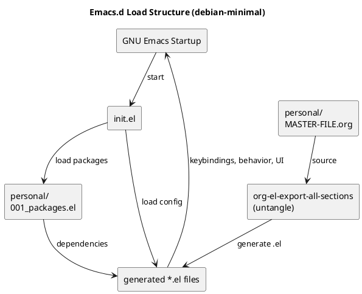

#+TITLE: .emacs.d debian-minimal optimised

* Intro
GNU Emacs 30.1 (build 2, x86_64-pc-linux-gnu, GTK+ Version 3.24.38, cairo version 1.16.0) of 2025-02-25

This is a minimalistic config I came up with after overloading the emacs-prelude-based one I was maintaining.

It has an prelude flavoured config style using a personal dir:

1. init.el -> system. Specifies load/exec paths, handles startup timing, garbage collection, setq variables etc
2. personal -> user. Loads packages, configs, keybindings, anything related to user behaviour/appearence

Packages used --> https://github.com/JasonSKK/.emacs/blob/debian-minimal/personal/001_packages.el

Note: The personal configuration is handled via the org-untangle package. The idea is that the full configuration is structured in an org-mode file (~/.emacs.d/personal/MASTER-FILE-250223.org) and is then exported to individual *.el.

#+begin_src 
org-el-export-all-sections
#+end_src

Startup structure in blocks depicted here: 

* checkout src
#+begin_src
cd ~/
mv -vn .emacs.d .emacs.d.bak # dont f overwrite your prev config plz
git clone git@github.com:JasonSKK/.emacs.git 
git checkout debian-minimal
mv -vn .emacs .emacs.d # rename with safety
#+end_src

* Build optimised GNU Emacs 30.1

Intel(R) Core(TM) i7-3770 CPU @ 3.40GHz

1 Clean the Previous Build (if required)
#+BEGIN_SRC 
make clean
make distclean
#+END_SRC

2 Install Dependencies
Run the following command based on your distro: Debian/Ubuntu
#+BEGIN_SRC 
sudo apt update && sudo apt install -y \
  build-essential libgccjit-12-dev libjansson-dev libtree-sitter-dev \
  libgif-dev libjpeg-dev libpng-dev libtiff-dev libwebp-dev librsvg2-dev \
  libxpm-dev libgtk-3-dev libharfbuzz-dev libncurses-dev \
  libmagickwand-dev libxml2-dev libgnutls28-dev \
  libsqlite3-dev libxaw3dxft-dev libgccjit0
#+END_SRC

3 Download and Extract Emacs Source Code
#+BEGIN_SRC 
curl -4O https://ftp.gnu.org/gnu/emacs/emacs-30.1.tar.xz
tar -xf emacs-30.1.tar.xz
cd emacs-30.1/
#+END_SRC

4 Configure with Optimal Flags
Run:
#+BEGIN_SRC 
./configure --prefix=/opt/emacs30 \
            --with-native-compilation=aot \
            --with-tree-sitter \
            --with-imagemagick \
            --with-harfbuzz \
            --with-cairo \
            --with-xinput2 \
            --with-mailutils \
            --with-x-toolkit=gtk3 \
            --with-threads \
            --enable-link-time-optimization \
            CFLAGS='-march=native -O3 -pipe -fomit-frame-pointer' \
            LDFLAGS='-Wl,-O1,--sort-common,--as-needed'
#+END_SRC

[!] Brief Explanation of Flags

| Flag                                                  | Purpose                                                              |
|-------------------------------------------------------+----------------------------------------------------------------------|
| --prefix=/opt/emacs30                                 | Install Emacs in /opt/emacs30 (no system interference).              |
| --with-native-compilation=aot                         | Ahead-of-time (AOT) compile Elisp to native code (faster execution). |
| --with-json                                           | Enable JSON support for packages like lsp-mode.                      |
| --with-tree-sitter                                    | Syntax highlighting improvements via tree-sitter.                    |
| --with-imagemagick                                    | Advanced image processing support.                                   |
| --with-harfbuzz                                       | Better text rendering (ligatures, complex scripts).                  |
| --with-cairo                                          | Modern rendering backend (faster UI).                                |
| --with-xinput2                                        | Improved input handling (trackpads, touchscreens, gestures).         |
| --with-mailutils                                      | Enables fetching mail in RMAIL.                                      |
| --with-x-toolkit=gtk3                                 | Use GTK3 UI (better integration on modern desktops).                 |
| --with-threads                                        | Enable threading support.                                            |
| --enable-link-time-optimization                       | Optimise linking for smaller & faster binaries.                      |
| CFLAGS='-march=native -O3 -pipe -fomit-frame-pointer' | Optimised compiler flags for best CPU performance.                   |
| LDFLAGS='-Wl,-O1,--sort-common,--as-needed'           | Optimise linking for faster execution.                               |

5 Compile and Install
#+BEGIN_SRC 
make -j$(nproc)
sudo make install
#+END_SRC

